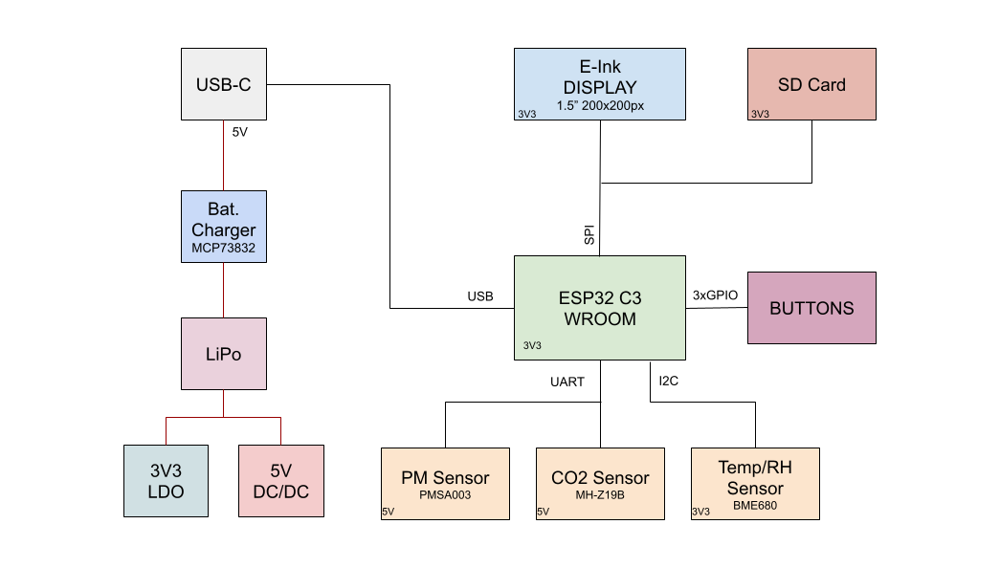
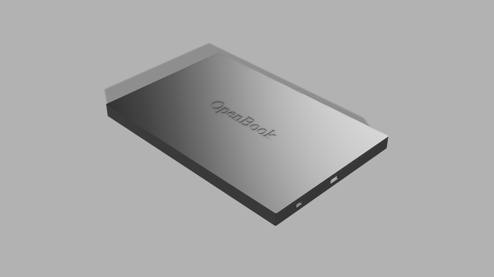
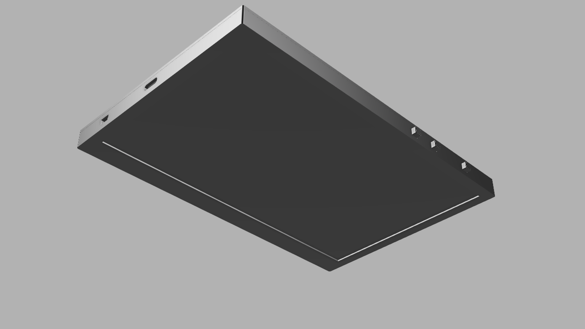
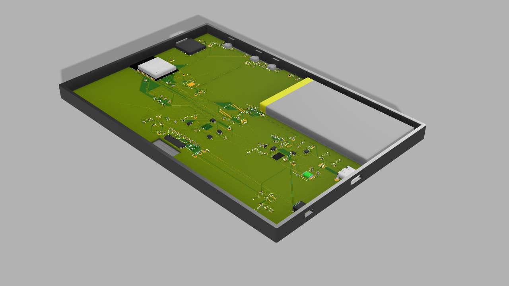

# OpenBook e-book reader

## BOM - Bill of Materials

| Device Module                       | Amount | Datasheet | Shop |
| ----------------------------------- | ------ | -------| --------|
| 112A-TAAR-R03_ATTEND                | 1      | https://www.attend.com.tw/en/product.php?act=view&id=253 | https://www.digikey.com/en/products/detail/attend-technology/112A-TAAR-R03/17633923 |
| BD5229G-TR                          | 1      | https://www.digikey.ph/en/products/detail/rohm-semiconductor/BD5229G-TR/658502 | https://www.digikey.ph/en/products/detail/rohm-semiconductor/BD5229G-TR/658502 |
| BUTTON_COSYOMV1                     | 3      | https://components101.com/switches/push-button | https://uk.farnell.com/wurth-elektronik/430182043816/switch-160gf-6x6mm-smd-4-3mm-act/dp/2065105?CMP=GRHB-OEMSECRETS101 |
| CPH3225A                            | 1      | https://www.digikey.com/en/products/detail/seiko-instruments/CPH3225A/8692444 | https://www.digikey.com/en/products/detail/seiko-instruments/CPH3225A/8692444 |
| DS3231SN                            | 1      | https://www.digikey.com/en/products/detail/analog-devices-inc-maxim-integrated/DS3231SN/1197576 | https://www.digikey.com/en/products/detail/analog-devices-inc-maxim-integrated/DS3231SN/1197576 |
| BME680                              | 1      | https://www.sparkfun.com/sparkfun-environmental-sensor-breakout-bme680-qwiic.html | https://www.sparkfun.com/sparkfun-environmental-sensor-breakout-bme680-qwiic.html |
| MCP73831                            | 1      | https://www.microchip.com/en-us/product/mcp73831 | https://www.microchipdirect.com/product/MCP73831T-2ADI/OT |
| C6-WROOM-1-N8                       | 1      | https://www.espressif.com/sites/default/files/documentation/esp32-c6-wroom-1_wroom-1u_datasheet_en.pdf | https://www.adafruit.com/product/5671 |
| FH34SRJ-24S-0.5SH_99_               | 1      | https://www.hirose.com/product/p/CL0580-1255-6-99 | https://www.hirose.com/product/p/CL0580-1255-6-99 |
| MAX17048G+T10                       | 1      | https://eu.mouser.com/ProductDetail/Analog-Devices-Maxim-Integrated/MAX17048G+T10?qs=D7PJwyCwLAoGnnn8jEPRBQ%3D%3D | https://eu.mouser.com/ProductDetail/Analog-Devices-Maxim-Integrated/MAX17048G+T10?qs=D7PJwyCwLAoGnnn8jEPRBQ%3D%3D |
| MBR0530                             | 3      | https://www.digikey.com/en/products/detail/onsemi/MBR0530/1048783 | https://www.digikey.com/en/products/detail/onsemi/MBR0530/1048783 |
| PGB1010603MR                        | 6      | https://www.digikey.com/en/products/detail/littelfuse-inc/PGB1010603MR/715755 | https://www.digikey.com/en/products/detail/littelfuse-inc/PGB1010603MR/715755 |
| SAMACSYS_PARTS_USB4110-GF-A         | 1      | https://www.digikey.ro/en/products/detail/gct/USB4110-GF-A/10384547 | https://www.digikey.ro/en/products/detail/gct/USB4110-GF-A/10384547 |
| SI1308EDL-T1-GE3                    | 1      | https://www.digikey.com/en/products/detail/vishay-siliconix/SI1308EDL-T1-GE3/4876435 | https://www.digikey.com/en/products/detail/vishay-siliconix/SI1308EDL-T1-GE3/4876435 |
| SJ                                  | 1      | https://www.digikey.com/en/products/detail/cui-devices/SJ1-3514N/738685 | https://www.digikey.com/en/products/detail/cui-devices/SJ1-3514N/738685 |
| USBLC6-2SC6Y                        | 1      | https://www.digikey.com/en/products/detail/stmicroelectronics/USBLC6-2SC6Y/2819177 | https://www.digikey.com/en/products/detail/stmicroelectronics/USBLC6-2SC6Y/2819177 |
| W25Q512JVEIQ                        | 1      | https://www.digikey.com/en/products/detail/winbond-electronics/W25Q512JVEIQ/10244706 | https://www.digikey.com/en/products/detail/winbond-electronics/W25Q512JVEIQ/10244706 |
| XC6220A331MR-G                      | 1      | https://www.digikey.com/en/products/detail/torex-semiconductor-ltd/XC6220B331MR-G/2138177 | https://www.digikey.com/en/products/detail/torex-semiconductor-ltd/XC6220B331MR-G/2138177 |
| SD0805S020S1R0                      | 2      | https://www.digikey.com/en/products/detail/kyocera-avx/SD0805S020S1R0/3749517 | https://www.digikey.com/en/products/detail/kyocera-avx/SD0805S020S1R0/3749517 |
| LTSPICE_C 100nF                     | 8      | https://www.digikey.com/en/products/detail/nextgen-components/0402B104K500HI/22601924 | https://www.digikey.com/en/products/detail/nextgen-components/0402B104K500HI/22601924 |
| LTSPICE_C 10nF                      | 1      | https://www.amazon.com/ALLECIN-Electrolytic-Capacitor-0-2x0-43in-Capacitors/dp/B0CMQC587X/ref=sr_1_1_sspa?sr=8-1-spons&sp_csd=d2lkZ2V0TmFtZT1zcF9hdGY&psc=1 | https://www.amazon.com/ALLECIN-Electrolytic-Capacitor-0-2x0-43in-Capacitors/dp/B0CMQC587X/ref=sr_1_1_sspa?sr=8-1-spons&sp_csd=d2lkZ2V0TmFtZT1zcF9hdGY&psc=1 |
| LTSPICE_C 4.7uF                     | 6      | https://www.amazon.com/ALLECIN-Electrolytic-Capacitor-0-2x0-43in-Capacitors/dp/B0CMQC587X/ref=sr_1_1_sspa?sr=8-1-spons&sp_csd=d2lkZ2V0TmFtZT1zcF9hdGY&psc=1 | https://www.amazon.com/ALLECIN-Electrolytic-Capacitor-0-2x0-43in-Capacitors/dp/B0CMQC587X/ref=sr_1_1_sspa?sr=8-1-spons&sp_csd=d2lkZ2V0TmFtZT1zcF9hdGY&psc=1 |
| LTSPICE_C 1uF                       | 10     | https://www.amazon.com/ALLECIN-Electrolytic-Capacitor-0-2x0-43in-Capacitors/dp/B0CMQC587X/ref=sr_1_1_sspa?sr=8-1-spons&sp_csd=d2lkZ2V0TmFtZT1zcF9hdGY&psc=1 | https://www.amazon.com/ALLECIN-Electrolytic-Capacitor-0-2x0-43in-Capacitors/dp/B0CMQC587X/ref=sr_1_1_sspa?sr=8-1-spons&sp_csd=d2lkZ2V0TmFtZT1zcF9hdGY&psc=1 |
| LTSPICE_C 0.1uF                     | 1      | https://www.digikey.com/en/products/detail/samsung-electro-mechanics/CL10E104KC8VPNC/20498486 | https://www.digikey.com/en/products/detail/samsung-electro-mechanics/CL10E104KC8VPNC/20498486 |
| ADAFRUIT_LED                        | 1      | https://www.adafruit.com/product/4684 | https://www.adafruit.com/product/4684 |
| ESP32_VARISTOR                      | 1      | https://uk.rs-online.com/web/p/varistors/9012743 | https://uk.rs-online.com/web/p/varistors/9012743 |
| CT3528 (RCL_CPOL-EU) 100uF          | 1      | https://www.datasheetarchive.com/?q=ct3528 |  |
| DMG2305UX-7 20V/4.2A/52mO/1.4W      | 2      | https://www.digikey.com/en/products/detail/diodes-incorporated/DMG2305UX-7/4340667 | https://www.digikey.com/en/products/detail/diodes-incorporated/DMG2305UX-7/4340667 |
| IND-4828-WE-TPC-WRE                 | 1      | https://www.axel-gl.com/en/asone/d/64-0172-48/ | https://www.axel-gl.com/en/asone/d/64-0172-48/ |
| JS-1MM(QWIIC_CONNECTOR)             | 1      | https://www.sparkfun.com/qwiic-jst-connector-smd-4-pin-horizontal.html | https://www.sparkfun.com/qwiic-jst-connector-smd-4-pin-horizontal.html |
| LTSPICE_R 5k1                       | 2      |  | https://www.amazon.com/BOJACK-Values-Resistor-Resistors-Assortment/dp/B08FD1XVL6/ref=sr_1_1_sspa?sr=8-1-spons&sp_csd=d2lkZ2V0TmFtZT1zcF9hdGY |
| LTSPICE_R 100k                      | 1      |  | https://www.amazon.com/BOJACK-Values-Resistor-Resistors-Assortment/dp/B08FD1XVL6/ref=sr_1_1_sspa?sr=8-1-spons&sp_csd=d2lkZ2V0TmFtZT1zcF9hdGY |
| LTSPICE_R 2.2                       | 1      |  | https://www.amazon.com/BOJACK-Values-Resistor-Resistors-Assortment/dp/B08FD1XVL6/ref=sr_1_1_sspa?sr=8-1-spons&sp_csd=d2lkZ2V0TmFtZT1zcF9hdGY |
| LTSPICE_R 10k                       | 16     |  | https://www.amazon.com/BOJACK-Values-Resistor-Resistors-Assortment/dp/B08FD1XVL6/ref=sr_1_1_sspa?sr=8-1-spons&sp_csd=d2lkZ2V0TmFtZT1zcF9hdGY |
| LTSPICE_R 0.47                      | 1      |  | https://www.amazon.com/BOJACK-Values-Resistor-Resistors-Assortment/dp/B08FD1XVL6/ref=sr_1_1_sspa?sr=8-1-spons&sp_csd=d2lkZ2V0TmFtZT1zcF9hdGY |
| LTSPICE_R 2k                        | 1      |  | https://www.amazon.com/BOJACK-Values-Resistor-Resistors-Assortment/dp/B08FD1XVL6/ref=sr_1_1_sspa?sr=8-1-spons&sp_csd=d2lkZ2V0TmFtZT1zcF9hdGY |
| LTSPICE_R 200                       | 1      |  | https://www.amazon.com/BOJACK-Values-Resistor-Resistors-Assortment/dp/B08FD1XVL6/ref=sr_1_1_sspa?sr=8-1-spons&sp_csd=d2lkZ2V0TmFtZT1zcF9hdGY |
| LTSPICE_R 15                        | 1      |  | https://www.amazon.com/BOJACK-Values-Resistor-Resistors-Assortment/dp/B08FD1XVL6/ref=sr_1_1_sspa?sr=8-1-spons&sp_csd=d2lkZ2V0TmFtZT1zcF9hdGY |
| Test Pad TP20R                      | 17     | https://us.misumi-ec.com/vona2/detail/221005496391/?HissuCode=TP20R-24 | https://us.misumi-ec.com/vona2/detail/221005496391/?HissuCode=TP20R-24 |

## ESP32-C6

- EN - RESET (Activare sau dezactivare device)
- IO0 - INT_RTC (Pin pentru intrerupere ale ceasului RTC sau Real Time Clock)
- IO1 - 32KHZ (Ofera o frecventa de 32 kHz, utilizata pentru sincronizare.)
- IO2 - MISO (Master In Slave Out, comunicare SPI pentru primire date de la periferice)
- IO3 - EPD_BUSY (Indica starea ecranului: ocupat sau liber)
- IO4 - SS_SD (Activeaza cardul SD, Slave Select)
- IO5 - EPD_DC (Control pentru date si comenzi ecran)
- IO6 - SCK (Serial Clock)
- IO7 - MOSI (Master Out Slave In, comunicare SPI pentru trimitere date la periferice)
- IO8 - GPIO8
- IO9 - IO/BOOT (Schimbare state dispozitiv)
- IO10 - EPD_CS (Select display)
- IO11 - FLASH_CS (Select memoria Flash)
- IO12 - USB_D- (comunicare USB)
- IO13 - USB_D+ (comunicare USB)
- IO15 - IO/CHANGE (navigare)
- IO16 - TX (Transmitere date)
- IO17 - RX (Receptie date)
- IO18 - RTC_RST (Reset RTC)
- IO19 - I2C_PW (Linia de alimentare pentru periferice I2C)
- IO20 - EPD_3V3_C (Alimentare)
- IO21 - SDA (I2C Data)
- IO22 - SCL (I2C Clock)
- IO23 - EPD_RST (Reset display)
- GND - Connected to ground 

## Randari

